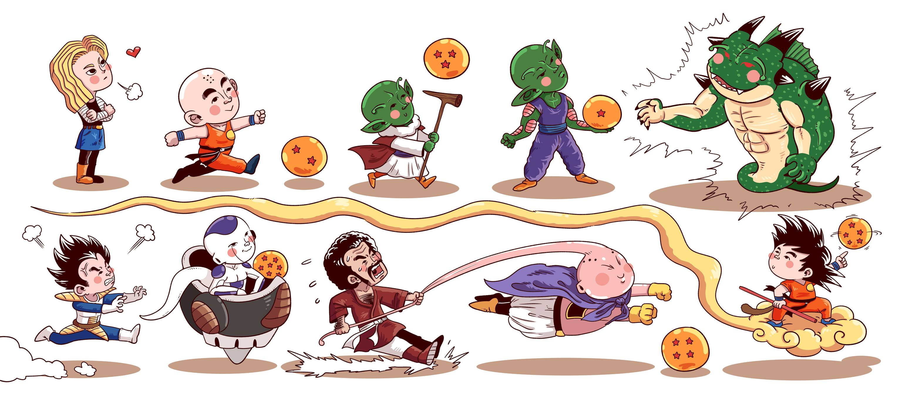

# Playing with AI - Papers

- 2012 [Alex Net - ImageNet Classification with Deep Convolutional Neural Networks](./files/Report%20paper%20(Alexnet).docx)

- 2014 [GAN - Generative Adversarial Networks](./files/Report%20paper%20(GANs).docx)

- 2015 [U-Net - Convolutional Networks for Biomedical Image Segmentation](./files/Report%20paper%20(Unet).docx)

- 2016 [ResNet - Deep Residual Learning for Image Recognition](./files/Report%20paper%20(Resnet).docx)

- 2017 [Enriching Word Vectors with Subword Information](./files/Report%20paper%20(Enriching%20Word%20Vectors%20with%20Subword%20Information).docx)

- 2017 [Attention is All You Need](./files/Report%20paper%20(Attention).docx)

- 2017 [CycleGAN - Unpaired Image-to-Image Translation using Cycle-Consistent Adversarial Networks](./files/Report%20paper%20(CycleGan).docx)

- 2018 [StarGAN: Unified Generative Adversarial Networks for Multi-Domain Image-to-Image Translation](/files/Report%20paper%20-%20StarGAN.docx)

- 2019 [EfficientNet - Rethinking Model Scaling for Convolutional Neural Networks](./files/Report%20paper%20(EfficientNet).docx)

- 2019 [BERT - Pre-training of Deep Bidirectional Transformers for Language Understanding](./files/Report%20paper%20(BERT).docx)

- 2020 [Denoising Diffusion Probabilistic Models](/files/Report%20paper%20(DDPM).docx)

- 2021 [Vision Transformer](./files/Report%20paper%20(Vision%20Transformer%20for%20classification).docx)

- 2021 [A Simple Single-Scale Vision Transformer for Object Detection and Instance Segmentation](/files/Report%20paper%20(UViT).docx)

- 2023 [Mamba: Linear-Time Sequence Modeling with Selective State Spaces](/files/Report%20paper%20(Mamba%20-%202023).docx)
